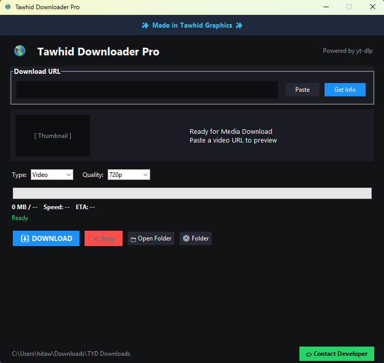
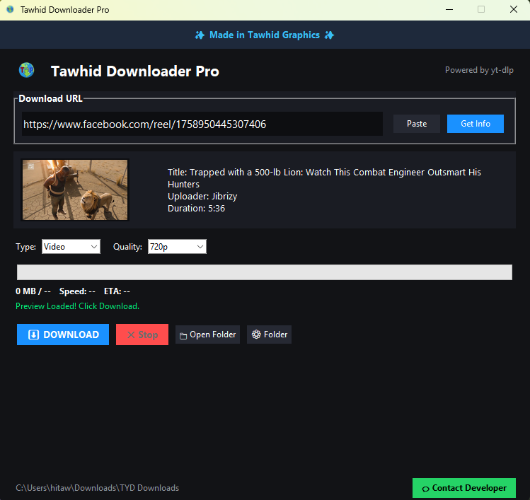

  

<h1 align="center">TDP — Tawhid Downloader Pro</h1>

  A powerful Windows video downloader supporting 1000+ websites.

  
  

  

A powerful Windows video downloader supporting 1000+ websites.

## 🚀 Download

**Latest Version: v2.0**

👉 Go to the **[Releases](../../releases)** page and download:

`Tawhid.Downloader.Pro.exe`
## 📸 Screenshots

  
  

<i>বাম দিকে: প্রথম ওপেন করার পর মেইন স্ক্রিন। ডান দিকে: URL পেস্ট করে ভিডিও প্রিভিউ লোড হওয়ার পর।</i>

## ✨ Features

* 🌐 Supports 1000+ supported websites
* 🎥 Video downloading
* 🎵 Audio downloading
* 🎚️ Multiple quality options
* 🖥️ Simple Windows interface
* ⚡ Fast and easy to use
* 💻 Windows 10 / 11 support

## 🖥️ System Requirements

* Windows 10 or Windows 11
* Internet connection
* Recommended: 4 GB RAM or more

## 📦 Installation

1. Open the **Releases** page.
2. Download `Tawhid.Downloader.Pro.exe`.
3. Run the `.exe` file.
4. Follow the application instructions.

## 🔄 Version

**Current version:** v2.0

## 🐛 Bug Reports

If you find a bug or have a problem, please open an **Issue** in this repository.

## ⚠️ Disclaimer

TDP is intended for downloading content that you are legally permitted to download. Users are responsible for complying with the terms of service, copyright laws, and applicable laws for the websites and content they access.

## 👨‍💻 Developer

**Tawhid**

**TDP — Tawhid Downloader Pro**
